# 🚀 Task Management API (Django REST Framework)
A professional Task Management Backend API built using Django and Django REST Framework.
This project simulates a real-world SaaS backend system with authentication, task management, filtering, and pagination.

---
## 🔥 Features
* 🔐 User Authentication (JWT)
* 📝 Create, Update, Delete Tasks (CRUD)
* 📊 Task Status System (Pending, In Progress, Completed)
* 🎯 Priority System (Low, Medium, High)
* 🔎 Search Tasks by Title
* 📂 Filter Tasks by Status
* 📄 Pagination Support
* 👤 User-specific Task Access (Secure API)
* ⏰ Deadline Management

---
## 🛠️ Tech Stack
* Python
* Django
* Django REST Framework
* JWT Authentication (SimpleJWT)
* SQLite

---

## 🔗 API Endpoints
### 🔐 Authentication
* `POST /api/auth/register/` → Register new user
* `POST /api/auth/login/` → Login and get access & refresh token

---
### 📌 Tasks
* `POST /api/taskscreate` → Create new task
* `GET /api/taskslist/` → Get all tasks (user-wise)
* `PUT /api/taskedit/<id>/` → Update task
* `DELETE /api/taskremove/<id>/` → Delete task

---
## 🔍 Query Parameters
* `?status=pending` → Filter by status
* `?search=task` → Search by title
* `?page=2` → Pagination

---
## 📸 Screenshots
| Feature | Preview |
|--------|--------|
| Admin1 | 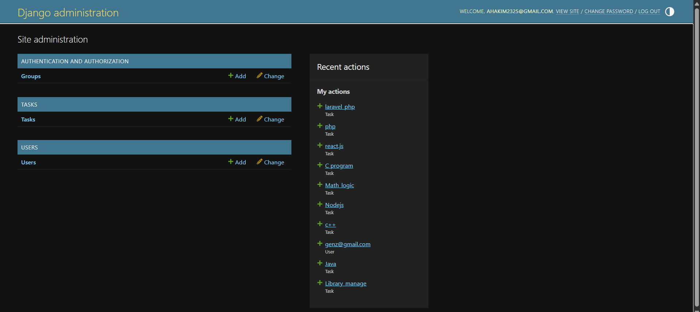 |
| Admin_Task | 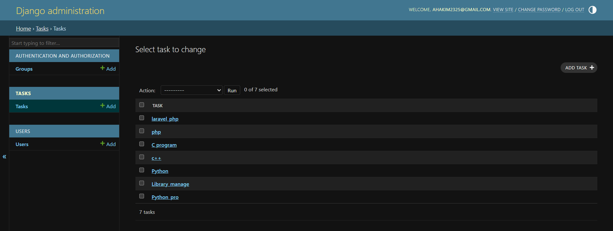 |
| Admin_user | 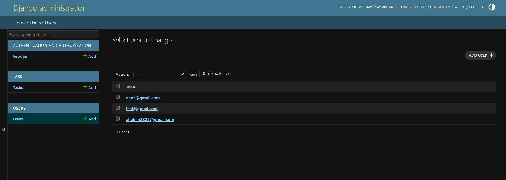 |
| Tasklogin | 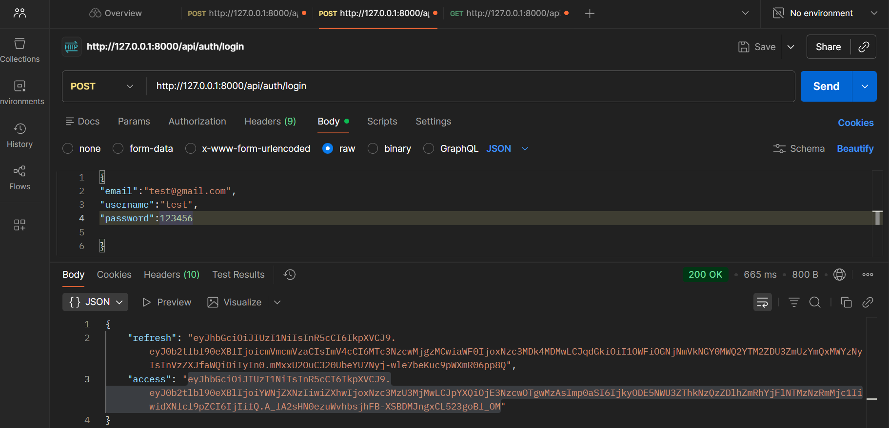 |
| Taskregister | 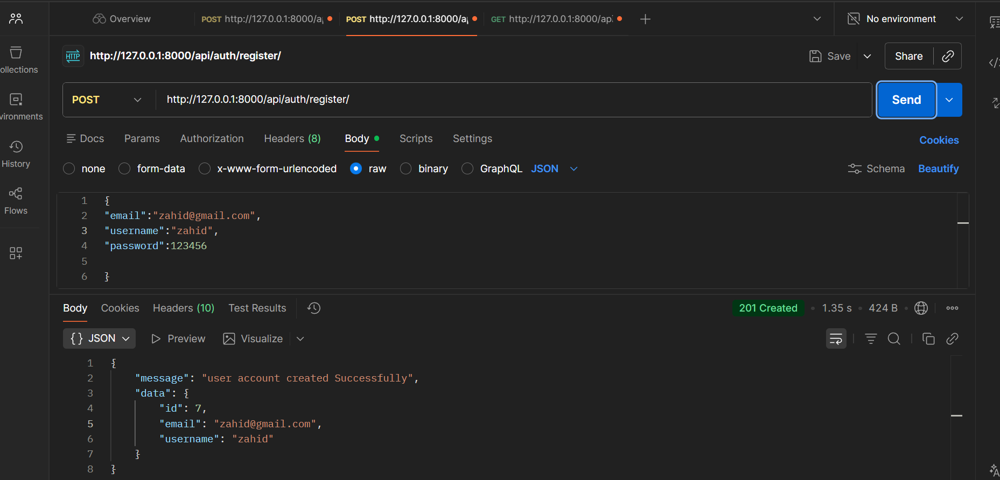 |
| Taskcreate | 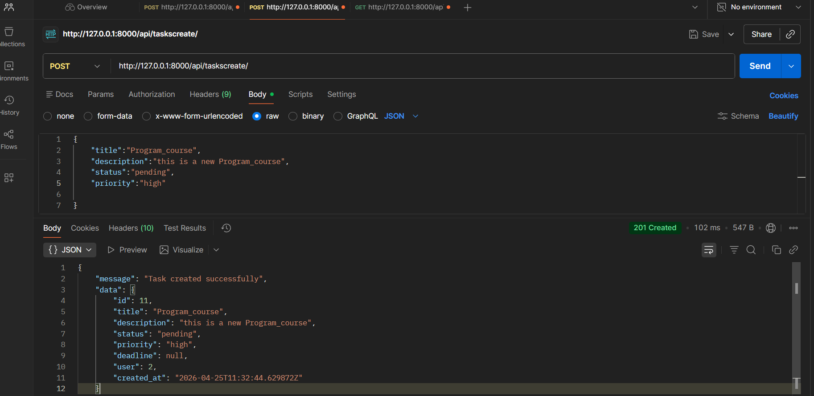 |
| Tasklist | 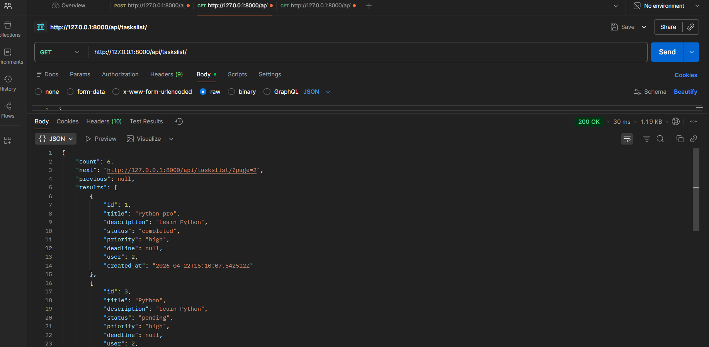 |
| Taskdetails | 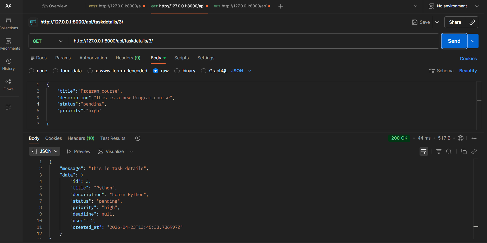 |
| Taskupdate | 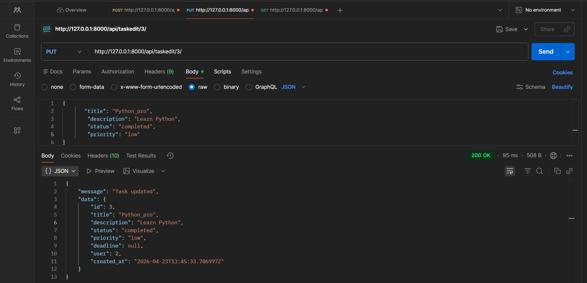 |
| Taskdelete | 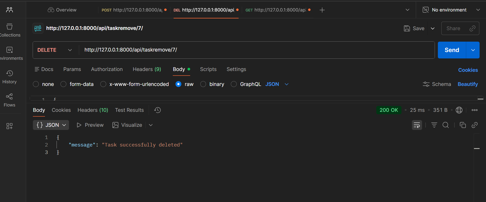 |
| Taskfilter | 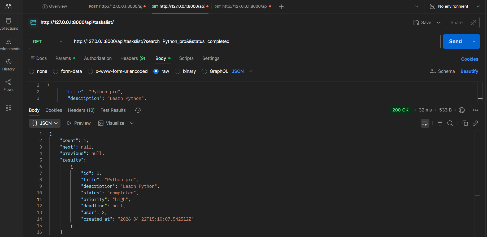 |


---
## ⚙️ Setup Instructions
```bash
git clone https://github.com/your-username/task-manager-api.git
cd task-manager-api
pip install -r requirements.txt
python manage.py migrate
python manage.py runserver
```

---
## 💡 About This Project
This project demonstrates real-world backend development skills:

* REST API Development
* JWT Authentication
* Secure User-based Access
* Filtering, Searching & Pagination
* Clean and Structured Code

---
## 👨‍💻 Author
**Abdul Hakim**
Backend Developer (Django REST Framework)

---
## ⭐ Support
If you like this project, give it a star ⭐
